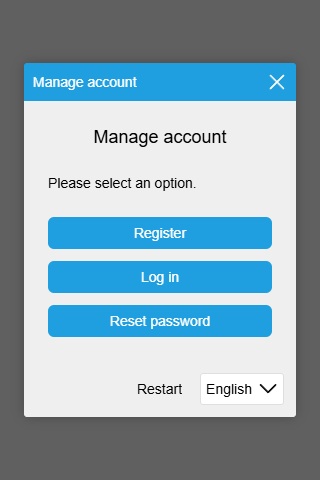
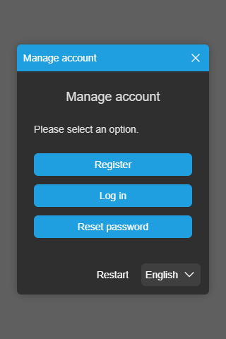

# @joelek/authentic

Standalone, flow-based, multi-factor authentication management system for web applications running on NodeJS.



```ts
import * as libhttp from "http";
import * as authentic from "@joelek/authentic/dist/lib/node";

const SERVER = new authentic.server.server.Server({
	mailer: new authentic.email.SMTPMailer({
		smtp: {
			hostname: "",
			port: 465,
			username: "",
			password: ""
		},
		defaults: {
			from_address: "",
			from_name: "", // Optional
			reply_address: "",
			reply_name: "" // Optional
		}
	})
});

const AUTH_REQUEST_LISTENER = SERVER.createAuthRequestListener({
	urlPrefix: "/auth"
});

const APP_REQUEST_LISTENER = SERVER.createAppRequestListener(async (request, access_handler) => {
	let user = access_handler.requireAuthorization(/* Required roles... */);
	return {
		payload: {
			user
		}
	};
});

const HTTP_SERVER = libhttp.createServer({}, async (request, response) => {
	let url = request.url ?? "/";
	if (url.startsWith("/auth/")) {
		return AUTH_REQUEST_LISTENER(request, response);
	} else {
		return APP_REQUEST_LISTENER(request, response);
	}
});

HTTP_SERVER.listen();
```

```ts
import * as authentic from "@joelek/authentic/dist/lib/browser";

let { element, controller } = authentic.ui.createElementAndController({
	client: authentic.client.createClient({
		urlPrefix: "/auth"
	})
});
document.body.appendChild(element);
controller.toggle();
```

## Background

A secure authentication management system is an indispensable tool when creating web applications. Without an authentication system, web applications lack a way of discerning users from one another which severly limits the range of possible features of the application.

Authentication management is inherently complex and can therefore be difficult to implement properly. Most web applications opt for the integration of a third-party system that provides the application with all required authentication features. Authentic is such a system.

## Features

### Standalone authentication system

Authentic is a full-stack authentication system that ships with a secure backend system as well as a intuitive user interface. The two components communicate through a simple HTTP-based protocol which enables the system to be integrated in the backend, frontend or as a full-stack solution. The system is standalone and communicates with no external servers.

### Registration, authentication and recovery

Authentic includes functionality for enabling a user to register a new account. The user starts this process by providing the system with a unique email address which is required to be verified as a mandatory step of the registration process.

Registered users may authenticate by following the on-screen instructions presented through the user interface. The user starts by identifying themselves by entering the email address they used when registering and will be asked to provide at least one authentication factor to become authenticated.

Registered users having lost access to their accounts may recover them by following the on screen instructions presented through the user interface. The user starts by identifying themselves by entering the email address they used when registering and access will be restored if they are able to re-verify the email address.

### Multi-factor authentication

Authentic includes support for multi-factor authentication via a combination of the following, commonly used authentication factors.

* Passphrase (default off)
* Verification code (default on)

The factors required may be configured when creating the `Server` instance.

```ts
const SERVER = new authentic.server.server.Server({
	require_passphrase: true,
	require_code: true
});
```

### Flow-based authentication

Authentic is a flow-based authentication system which makes it extremely flexible. Configuration changes made in the backend are automatically reflected through the user interface allowing for authentication factors to be enabled or disabled as needed. The flow-based approach also allows for different authentication paths to be taken depending on the path previously taken by the user, inherently making the system safer.

### Object storage

Authentic stores objects (users, roles, user_roles, sessions and origins) using volatile storage by default. This is great when integrating an application with the system but limits the application as all objects will be discarded once the server is restarted.

Non-volatile object storage is expected to eventually be configured when creating the `Server` instance.

```ts
const DETAIL = {
	async getConnection() {
		return {
			async query(sql, parameters) {
				// Should execute the provided sql using the provided parameters and return the result, preferrably using a prepared statement.
			}
		};
	}
};

const SERVER = new authentic.server.server.Server({
	users: new authentic.server.stores.user.DatabaseUserStore(DETAIL, "users"),
	roles: new authentic.server.stores.role.DatabaseRoleStore(DETAIL, "roles"),
	user_roles: new authentic.server.stores.user_role.DatabaseUserRoleStore(DETAIL, "user_roles"),
	sessions: new authentic.server.stores.session.DatabaseSessionStore(DETAIL, "sessions"),
	origins: new authentic.server.stores.origin.DatabaseOriginStore(DETAIL, "origins")
});
```

The tables are expected to be compatible with the following `CREATE` statements.

```sql
CREATE TABLE origins (
	origin_id VARCHAR(32) PRIMARY KEY NOT NULL,
	created_utc BIGINT NOT NULL,
	updated_utc BIGINT NOT NULL,
	address VARCHAR(31) NOT NULL,
	expires_utc BIGINT NOT NULL,
	wait_until_utc BIGINT NOT NULL,
	UNIQUE INDEX address (address),
	INDEX expires_utc (expires_utc)
);

CREATE TABLE users (
	user_id VARCHAR(32) PRIMARY KEY NOT NULL,
	created_utc BIGINT NOT NULL,
	updated_utc BIGINT NOT NULL,
	username VARCHAR(31),
	email VARCHAR(255) NOT NULL,
	passdata VARCHAR(127) NOT NULL,
	UNIQUE INDEX username (username),
	UNIQUE INDEX email (email)
);

CREATE TABLE roles (
	role_id VARCHAR(32) PRIMARY KEY NOT NULL,
	created_utc BIGINT NOT NULL,
	updated_utc BIGINT NOT NULL,
	name VARCHAR(255) NOT NULL,
	UNIQUE INDEX name (name)
);

CREATE TABLE user_roles (
	user_role_id VARCHAR(32) PRIMARY KEY NOT NULL,
	created_utc BIGINT NOT NULL,
	updated_utc BIGINT NOT NULL,
	user_id VARCHAR(32) NOT NULL,
	role_id VARCHAR(32) NOT NULL,
	FOREIGN KEY (user_id) REFERENCES users(user_id) ON UPDATE RESTRICT ON DELETE RESTRICT,
	FOREIGN KEY (role_id) REFERENCES roles(role_id) ON UPDATE RESTRICT ON DELETE RESTRICT,
	INDEX user_id (user_id),
	INDEX role_id (role_id),
	UNIQUE INDEX user_id_role_id (user_id, role_id)
);

CREATE TABLE sessions (
	session_id VARCHAR(32) PRIMARY KEY NOT NULL,
	created_utc BIGINT NOT NULL,
	updated_utc BIGINT NOT NULL,
	type VARCHAR(63) NOT NULL,
	reason VARCHAR(63) NOT NULL,
	expires_utc BIGINT NOT NULL,
	wait_until_utc BIGINT NOT NULL,
	username VARCHAR(31),
	username_attempts INT,
	email VARCHAR(255),
	email_attempts INT,
	code_hash VARCHAR(64),
	code_hash_attempts INT,
	passdata VARCHAR(127),
	passdata_attempts INT,
	authenticated_user_id VARCHAR(32),
	ticket_hash VARCHAR(64),
	FOREIGN KEY (authenticated_user_id) REFERENCES users(user_id) ON UPDATE CASCADE ON DELETE SET NULL,
	INDEX expires_utc (expires_utc),
	INDEX authenticated_user_id (authenticated_user_id)
);
```

### Localization

Authentic is fully localized to support the following languages:

* English (default)
* Swedish

The preferred language is automatically detected by the user interface and subsequently sent to the backend system.

Localized email templates may be configured when creating the `Server` instance. Variables specified using the `{{variable}}` syntax will be automatically replaced with the corresponding values. Variables are supported in the subject as well as in the message.

```ts
const SERVER = new authentic.server.Server({
	// Variables available are ["code"].
	waiting_for_register_code_email_template: {
		en: {
			subject: "Verification code",
			message: "The verification code is: {{code}}",
			html: false
		},
		sv: {
			subject: "Verifieringskod",
			message: "Verifieringskoden är: {{code}}",
			html: false
		}
	},
	// Variables available are ["code"].
	waiting_for_authenticate_code_email_template: {
		en: {
			subject: "Verification code",
			message: "The verification code is: {{code}}",
			html: false
		},
		sv: {
			subject: "Verifieringskod",
			message: "Verifieringskoden är: {{code}}",
			html: false
		}
	},
	// Variables available are ["code"].
	waiting_for_recover_code_email_template: {
		en: {
			subject: "Verification code",
			message: "The verification code is: {{code}}",
			html: false
		},
		sv: {
			subject: "Verifieringskod",
			message: "Verifieringskoden är: {{code}}",
			html: false
		}
	}
});
```

### Themes

Authentic can be configured with either a light theme or a dark theme.




The active theme is configured through the user interface controller.

```ts
controller.getTheme().update("light");
controller.getTheme().update("dark");
```

## Sponsorship

The continued development of this software depends on your sponsorship. Please consider sponsoring this project if you find that the software creates value for you and your organization.

The sponsor button can be used to view the different sponsoring options. Contributions of all sizes are welcome.

Thank you for your support!

### Ethereum

Ethereum contributions can be made to address `0xf1B63d95BEfEdAf70B3623B1A4Ba0D9CE7F2fE6D`.


## Installation

Releases follow semantic versioning and release packages are published using the GitHub platform. Use the following command to install the latest release.

```
npm install joelek/authentic#semver:^0.0
```

Use the following command to install the very latest build. The very latest build may include breaking changes and should not be used in production environments.

```
npm install joelek/authentic#master
```

NB: This project targets TypeScript 4 in strict mode.

## Roadmap

* Use AVL-tree for indices in VolatileObjectStore class.
* Consider adding display name.
* Consider adding registration keys.
* Add functionality for creating and updating database tables.
